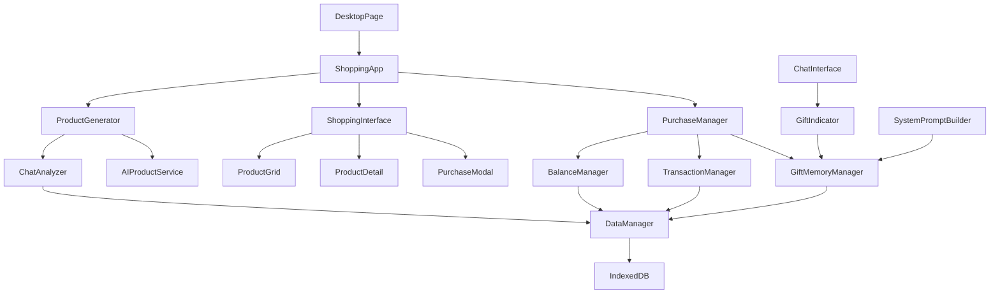

# 设计文档

## 概述

AI智能购物系统是一个集成到现有QQ聊天应用中的购物模块，它通过分析用户的聊天记录来智能生成个性化商品推荐。用户可以为AI角色购买虚拟礼物，这些礼物将成为AI角色的永久记忆，并在聊天界面中显示视觉指示器。

## 架构

### 系统架构图



### 数据流

1. **商品生成流程**：
   - ChatAnalyzer 分析所有聊天记录
   - AIProductService 调用API生成商品
   - ProductGenerator 格式化商品数据
   - ShoppingInterface 显示商品列表

2. **购买流程**：
   - 用户选择商品和AI角色
   - PurchaseManager 验证余额
   - BalanceManager 扣除余额
   - TransactionManager 记录交易
   - GiftMemoryManager 更新AI记忆

3. **显示流程**：
   - ChatInterface 加载AI角色的礼物记忆
   - GiftIndicator 显示购买指示器
   - SystemPromptBuilder 将礼物信息注入AI提示词

## 组件和接口

### 文件结构

所有购物系统相关的组件必须放置在以下目录结构中：

```
src/app/components/shopping/
├── ShoppingApp.tsx                 # 主购物应用组件
├── ShoppingApp.css                 # 主应用样式
├── components/
│   ├── ProductGrid.tsx             # 商品网格组件
│   ├── ProductGrid.css
│   ├── ProductCard.tsx             # 商品卡片组件
│   ├── ProductCard.css
│   ├── ProductDetail.tsx           # 商品详情组件
│   ├── ProductDetail.css
│   ├── PurchaseModal.tsx           # 购买模态框组件
│   ├── PurchaseModal.css
│   ├── GiftIndicator.tsx           # 礼物指示器组件
│   └── GiftIndicator.css
├── services/
│   ├── ProductGenerator.ts         # 商品生成服务
│   ├── ChatAnalyzer.ts             # 聊天分析服务
│   ├── AIProductService.ts         # AI商品生成服务
│   ├── PurchaseManager.ts          # 购买管理服务
│   └── GiftMemoryManager.ts        # 礼物记忆管理服务
├── types/
│   ├── shopping.ts                 # 购物相关类型定义
│   └── gift.ts                     # 礼物相关类型定义
└── utils/
    ├── priceGenerator.ts           # 价格生成工具
    ├── iconGenerator.ts            # 图标生成工具
    └── categoryClassifier.ts       # 商品分类工具
```

### 核心组件

#### 1. ShoppingApp 主组件 (src/app/components/shopping/ShoppingApp.tsx)
```typescript
interface ShoppingAppProps {
  onBack: () => void;
  currentBalance: number;
  availableChats: ChatItem[];
  apiConfig: ApiConfig;
}

interface ShoppingAppState {
  products: Product[];
  isLoading: boolean;
  selectedProduct: Product | null;
  showPurchaseModal: boolean;
}
```

#### 2. ProductGenerator 商品生成器 (src/app/components/shopping/services/ProductGenerator.ts)
```typescript
interface ProductGenerator {
  generateProducts(chatHistory: Message[], apiConfig: ApiConfig): Promise<Product[]>;
  refreshProducts(): Promise<Product[]>;
}

interface Product {
  id: string;
  name: string;
  description: string;
  price: number;
  icon: string;
  category: string;
  generatedFrom: string[]; // 基于哪些聊天记录生成
  timestamp: number;
}
```

#### 3. PurchaseManager 购买管理器 (src/app/components/shopping/services/PurchaseManager.ts)
```typescript
interface PurchaseManager {
  purchaseProduct(product: Product, aiCharacter: string, userId: string): Promise<PurchaseResult>;
  validatePurchase(product: Product, balance: number): boolean;
}

interface PurchaseResult {
  success: boolean;
  transactionId: string;
  newBalance: number;
  error?: string;
}
```

#### 4. GiftMemoryManager 礼物记忆管理器 (src/app/components/shopping/services/GiftMemoryManager.ts)
```typescript
interface GiftMemoryManager {
  addGiftToMemory(aiCharacterId: string, gift: Gift): Promise<void>;
  getGiftsForCharacter(aiCharacterId: string): Promise<Gift[]>;
  updateSystemPrompt(aiCharacterId: string): Promise<string>;
}

interface Gift {
  id: string;
  productId: string;
  productName: string;
  productDescription: string;
  price: number;
  purchaseDate: number;
  fromUser: string;
  aiCharacterId: string;
  chatId: string;
}
```

#### 5. GiftIndicator 礼物指示器组件 (src/app/components/shopping/components/GiftIndicator.tsx)
```typescript
interface GiftIndicatorProps {
  aiCharacterId: string;
  gifts: Gift[];
  onClick: () => void;
}
```

### 集成点

#### DesktopPage 集成
- 修改 `src/app/components/DesktopPage.tsx` 中的购物应用状态从 'coming-soon' 改为 'available'
- 添加余额检查逻辑，只有余额 > ¥5 时才允许访问
- 添加 ShoppingApp 组件的导入和路由

#### ChatInterface 集成
- 修改 `src/app/components/qq/ChatInterface.tsx` 添加 GiftIndicator 组件
- 在消息渲染中集成礼物指示器显示
- 更新系统提示词构建逻辑，包含礼物记忆

#### DataManager 集成
- 扩展 `src/app/utils/dataManager.ts` 添加礼物和购物相关的数据库操作
- 新增 GIFT_STORE 和 SHOPPING_TRANSACTION_STORE 数据存储

### 数据模型

#### 商品数据模型
```typescript
interface Product {
  id: string;
  name: string;
  description: string;
  price: number;
  icon: string; // emoji或图标
  category: 'food' | 'accessory' | 'toy' | 'book' | 'digital' | 'nsfw' | 'other';
  generatedFrom: string[]; // 基于的聊天消息ID
  timestamp: number;
  popularity?: number; // 受欢迎程度
  isNsfw?: boolean; // 是否为成人内容，用于额外标记和过滤
}
```

#### 礼物数据模型
```typescript
interface Gift {
  id: string;
  productId: string;
  productName: string;
  productDescription: string;
  productIcon: string;
  productCategory: 'food' | 'accessory' | 'toy' | 'book' | 'digital' | 'nsfw' | 'other';
  price: number;
  purchaseDate: number;
  fromUser: string;
  fromUserNickname: string;
  aiCharacterId: string;
  aiCharacterName: string;
  chatId: string;
  transactionId: string;
  isNsfw?: boolean; // 是否为成人内容
}
```

#### 购物交易记录
```typescript
interface ShoppingTransaction extends TransactionRecord {
  productId: string;
  productName: string;
  aiCharacterId: string;
  aiCharacterName: string;
  giftId: string;
}
```

## 错误处理

### 错误类型定义
```typescript
enum ShoppingErrorType {
  INSUFFICIENT_BALANCE = 'insufficient_balance',
  API_ERROR = 'api_error',
  NETWORK_ERROR = 'network_error',
  INVALID_PRODUCT = 'invalid_product',
  DATABASE_ERROR = 'database_error',
  GENERATION_FAILED = 'generation_failed'
}

interface ShoppingError {
  type: ShoppingErrorType;
  message: string;
  details?: any;
}
```

### 错误处理策略

1. **余额不足**：显示友好提示，引导用户查看余额
2. **API调用失败**：提供重试机制，显示离线模式
3. **网络错误**：缓存商品数据，支持离线浏览
4. **数据库错误**：提供数据恢复选项
5. **商品生成失败**：提供默认商品模板

## 测试策略

### 单元测试
- ProductGenerator 商品生成逻辑
- PurchaseManager 购买验证逻辑
- GiftMemoryManager 记忆管理逻辑
- BalanceManager 余额计算逻辑

### 集成测试
- 完整购买流程测试
- 数据库操作测试
- API调用测试
- 组件交互测试

### 端到端测试
- 用户购买商品完整流程
- 礼物指示器显示测试
- AI记忆集成测试
- 余额同步测试

### 性能测试
- 大量聊天记录分析性能
- 商品生成速度测试
- 数据库查询优化测试
- 界面响应速度测试

## 安全考虑

### 数据安全
- 所有交易记录加密存储
- 用户聊天数据本地处理
- API密钥安全管理
- 防止SQL注入和XSS攻击

### 业务安全
- 余额验证双重检查
- 交易原子性保证
- 防止重复购买
- 价格合理性验证

### 隐私保护
- 聊天内容不上传到服务器
- 商品生成本地化处理
- 用户数据匿名化
- 符合数据保护法规

## 性能优化

### 前端优化
- 商品列表虚拟滚动
- 图片懒加载
- 组件按需加载
- 状态管理优化

### 数据库优化
- 索引优化
- 查询缓存
- 批量操作
- 数据分页

### API优化
- 请求去重
- 响应缓存
- 错误重试
- 超时处理

### 内存优化
- 及时清理无用数据
- 图片资源管理
- 事件监听器清理
- 内存泄漏检测