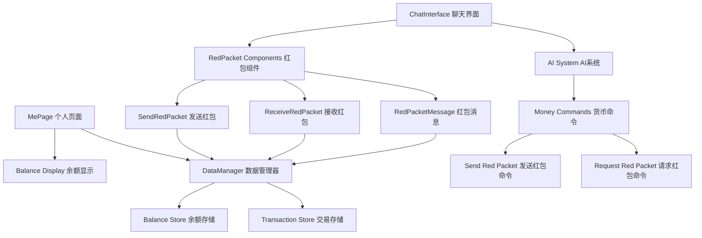

# 设计文档

## 概述

虚拟货币和红包系统是一个集成到现有聊天应用中的功能模块，允许用户与AI角色进行虚拟货币交互。系统采用模块化设计，包含数据库扩展、UI组件、AI命令处理和状态管理等核心部分。

## 架构

### 系统架构图



### 数据流

1. **用户发送红包**: ChatInterface → SendRedPacket → DataManager → 更新余额 → 更新聊天记录
2. **AI发送红包**: AI命令 → ChatInterface → ReceiveRedPacket → DataManager → 更新余额
3. **余额显示**: MePage → DataManager → 获取余额 → 显示更新

## 组件和接口

### 1. 数据库扩展 (DataManager)

#### 新增存储结构
```typescript
// 余额存储
interface BalanceData {
  id: 'default';
  balance: number;
  lastUpdated: number;
}

// 交易记录存储
interface TransactionRecord {
  id: string;
  type: 'send' | 'receive';
  amount: number;
  chatId: string;
  fromUser: string;
  toUser: string;
  message?: string;
  timestamp: number;
  status: 'pending' | 'completed' | 'failed';
}
```

#### 新增方法
- `saveBalance(balance: number): Promise<void>`
- `getBalance(): Promise<number>`
- `addTransaction(transaction: TransactionRecord): Promise<void>`
- `getTransactionHistory(limit?: number): Promise<TransactionRecord[]>`

### 2. 红包组件 (C:\Projects\phone\src\app\components\qq\money\)

#### SendRedPacket.tsx
发送红包的模态框组件
```typescript
interface SendRedPacketProps {
  isOpen: boolean;
  onClose: () => void;
  onSend: (amount: number, message: string) => Promise<void>;
  currentBalance: number;
  recipientName: string;
}
```

#### ReceiveRedPacket.tsx
接收红包的组件
```typescript
interface ReceiveRedPacketProps {
  redPacket: RedPacketData;
  onClaim: (redPacketId: string) => Promise<void>;
  isClaimed: boolean;
}
```

#### RedPacketMessage.tsx
聊天中显示的红包消息组件
```typescript
interface RedPacketMessageProps {
  message: Message;
  onClaim?: (redPacketId: string) => Promise<void>;
  onSend?: () => void;
}
```

### 3. 消息类型扩展

#### 新增消息类型
```typescript
// 扩展现有的 Message 类型
interface RedPacketMessage extends Message {
  type: 'red_packet_send' | 'red_packet_receive' | 'red_packet_request';
  redPacketData: {
    id: string;
    amount: number;
    message?: string;
    senderName: string;
    recipientName: string;
    isClaimed: boolean;
    claimedAt?: number;
  };
}
```

### 4. AI命令系统扩展

#### 新增AI命令格式
```typescript
// 发送红包命令
{
  "type": "send_red_packet",
  "name": "AI角色名",
  "amount": 10.5,
  "message": "恭喜发财！"
}

// 请求红包命令
{
  "type": "request_red_packet",
  "name": "AI角色名",
  "message": "求红包～"
}
```

## 数据模型

### 1. 余额数据模型
```typescript
interface BalanceData {
  id: 'default';
  balance: number;
  lastUpdated: number;
}
```

### 2. 红包数据模型
```typescript
interface RedPacketData {
  id: string;
  amount: number;
  message?: string;
  senderName: string;
  senderAvatar: string;
  recipientName: string;
  chatId: string;
  timestamp: number;
  isClaimed: boolean;
  claimedAt?: number;
}
```

### 3. 交易记录模型
```typescript
interface TransactionRecord {
  id: string;
  type: 'send' | 'receive';
  amount: number;
  chatId: string;
  fromUser: string;
  toUser: string;
  message?: string;
  timestamp: number;
  status: 'pending' | 'completed' | 'failed';
}
```

## 错误处理

### 1. 余额不足处理
- 发送红包前检查余额
- 显示友好的错误提示
- 阻止发送操作

### 2. 数据库错误处理
- 数据库操作失败时回退到localStorage
- 提供错误恢复机制
- 记录错误日志

### 3. AI命令错误处理
- 验证AI命令格式
- 处理无效金额
- 提供命令格式提示

## 测试策略

### 1. 单元测试
- DataManager的余额操作方法
- 红包组件的状态管理
- AI命令解析逻辑

### 2. 集成测试
- 完整的红包发送流程
- AI红包命令处理
- 数据库事务一致性

### 3. 用户界面测试
- 红包组件的交互体验
- 余额显示的实时更新
- 错误状态的用户反馈

## 性能考虑

### 1. 数据库优化
- 使用索引优化交易记录查询
- 批量处理多个红包操作
- 缓存余额数据减少数据库访问

### 2. UI性能
- 红包动画使用CSS3硬件加速
- 虚拟化长交易记录列表
- 防抖处理频繁的余额更新

### 3. 内存管理
- 及时清理不需要的红包状态
- 限制内存中的交易记录数量
- 使用WeakMap管理组件引用

## 安全考虑

### 1. 数据验证
- 验证红包金额的合法性
- 防止负数或过大金额
- 检查用户权限

### 2. 状态一致性
- 确保余额更新的原子性
- 防止并发操作导致的数据不一致
- 实现乐观锁机制

### 3. 用户体验安全
- 防止意外的大额转账
- 提供操作确认机制
- 记录所有货币操作日志

## 扩展性设计

### 1. 多货币支持
- 设计支持多种虚拟货币的架构
- 货币转换接口预留
- 汇率管理系统

### 2. 高级红包功能
- 群红包（多人领取）
- 定时红包
- 条件红包（答题红包等）

### 3. 统计和分析
- 用户消费行为分析
- 红包使用统计
- 经济系统平衡监控