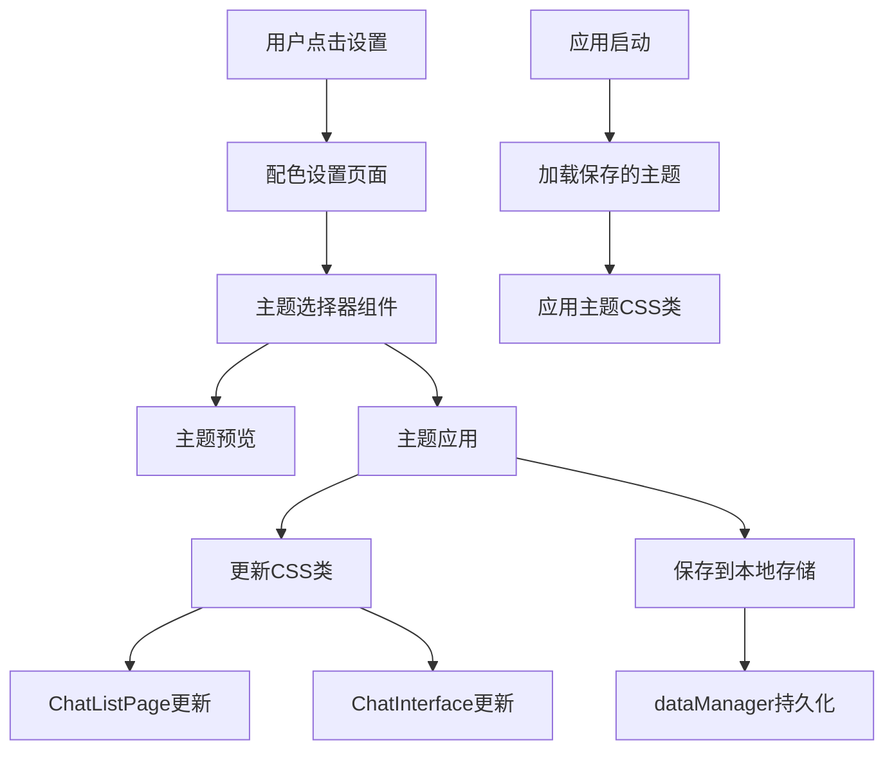

# 主题配色系统设计文档

## 概述

设计一个基于CSS变量的主题配色系统，允许用户在设置页面中选择不同的配色方案。系统将通过动态切换CSS类来实现主题变更，主要影响聊天列表页面和聊天界面的视觉外观。

## 架构

### 系统架构图



### 技术架构

1. **主题定义层**: 在globals.css中定义多套主题CSS变量
2. **主题管理层**: ThemeManager类负责主题切换和持久化
3. **UI组件层**: ColorSettingsPage组件提供用户界面
4. **应用层**: 在应用启动时自动加载用户选择的主题

## 组件和接口

### 1. 主题定义 (globals.css)

```css
/* 默认主题 (白色) */
:root {
  --theme-bg-primary: #ffffff;
  --theme-bg-secondary: #f8f9fa;
  --theme-bg-tertiary: #e9ecef;
  --theme-text-primary: #1f1f1f;
  --theme-text-secondary: #6c757d;
  --theme-text-tertiary: #8a8a8a;
  --theme-accent-color: #007bff;
  --theme-accent-hover: #0056b3;
  --theme-border-color: #dee2e6;
  --theme-border-light: #e9ecef;
  --theme-shadow-light: 0 1px 3px rgba(0, 0, 0, 0.1);
  --theme-shadow-medium: 0 2px 8px rgba(0, 0, 0, 0.15);
  --theme-shadow-heavy: 0 4px 16px rgba(0, 0, 0, 0.2);
  --theme-message-user-bg: #007bff;
  --theme-message-ai-bg: #ffffff;
  --theme-message-user-text: #ffffff;
  --theme-message-ai-text: #1f1f1f;
  --theme-header-bg: rgba(247, 247, 247, 0.95);
  --theme-nav-bg: #ffffff;
  --theme-nav-active: #007bff;
}

/* 深色主题 */
.theme-dark {
  --theme-bg-primary: #1a1a1a;
  --theme-bg-secondary: #2d2d2d;
  --theme-bg-tertiary: #404040;
  --theme-text-primary: #ffffff;
  --theme-text-secondary: #b0b0b0;
  --theme-text-tertiary: #808080;
  --theme-accent-color: #4dabf7;
  --theme-accent-hover: #339af0;
  --theme-border-color: #404040;
  --theme-border-light: #2d2d2d;
  --theme-shadow-light: 0 1px 3px rgba(255, 255, 255, 0.1);
  --theme-shadow-medium: 0 2px 8px rgba(255, 255, 255, 0.15);
  --theme-shadow-heavy: 0 4px 16px rgba(255, 255, 255, 0.2);
  --theme-message-user-bg: #4dabf7;
  --theme-message-ai-bg: #2d2d2d;
  --theme-message-user-text: #ffffff;
  --theme-message-ai-text: #ffffff;
  --theme-header-bg: rgba(26, 26, 26, 0.95);
  --theme-nav-bg: #1a1a1a;
  --theme-nav-active: #4dabf7;
}

/* 男性主题 (深蓝商务风) */
.theme-masculine {
  --theme-bg-primary: #0f1419;
  --theme-bg-secondary: #1a2332;
  --theme-bg-tertiary: #253341;
  --theme-text-primary: #ffffff;
  --theme-text-secondary: #8fa3b3;
  --theme-text-tertiary: #6b7d8f;
  --theme-accent-color: #00d4ff;
  --theme-accent-hover: #00b8e6;
  --theme-border-color: #2d3e50;
  --theme-border-light: #34495e;
  --theme-shadow-light: 0 1px 3px rgba(0, 212, 255, 0.2);
  --theme-shadow-medium: 0 2px 8px rgba(0, 212, 255, 0.25);
  --theme-shadow-heavy: 0 4px 16px rgba(0, 212, 255, 0.3);
  --theme-message-user-bg: #00d4ff;
  --theme-message-ai-bg: #1a2332;
  --theme-message-user-text: #0f1419;
  --theme-message-ai-text: #ffffff;
  --theme-header-bg: rgba(15, 20, 25, 0.95);
  --theme-nav-bg: #0f1419;
  --theme-nav-active: #00d4ff;
}

/* 女性主题 (粉色温柔风) */
.theme-feminine {
  --theme-bg-primary: #fdf2f8;
  --theme-bg-secondary: #fce7f3;
  --theme-bg-tertiary: #fbcfe8;
  --theme-text-primary: #831843;
  --theme-text-secondary: #be185d;
  --theme-text-tertiary: #ec4899;
  --theme-accent-color: #f472b6;
  --theme-accent-hover: #ec4899;
  --theme-border-color: #f9a8d4;
  --theme-border-light: #fbb6ce;
  --theme-shadow-light: 0 1px 3px rgba(244, 114, 182, 0.2);
  --theme-shadow-medium: 0 2px 8px rgba(244, 114, 182, 0.25);
  --theme-shadow-heavy: 0 4px 16px rgba(244, 114, 182, 0.3);
  --theme-message-user-bg: #f472b6;
  --theme-message-ai-bg: #fce7f3;
  --theme-message-user-text: #ffffff;
  --theme-message-ai-text: #831843;
  --theme-header-bg: rgba(253, 242, 248, 0.95);
  --theme-nav-bg: #fdf2f8;
  --theme-nav-active: #f472b6;
}

/* 二次元主题 (紫色梦幻风) */
.theme-anime {
  --theme-bg-primary: #f3e8ff;
  --theme-bg-secondary: #e9d5ff;
  --theme-bg-tertiary: #ddd6fe;
  --theme-text-primary: #581c87;
  --theme-text-secondary: #7c3aed;
  --theme-text-tertiary: #a855f7;
  --theme-accent-color: #c084fc;
  --theme-accent-hover: #a855f7;
  --theme-border-color: #d8b4fe;
  --theme-border-light: #e9d5ff;
  --theme-shadow-light: 0 1px 3px rgba(192, 132, 252, 0.3);
  --theme-shadow-medium: 0 2px 8px rgba(192, 132, 252, 0.35);
  --theme-shadow-heavy: 0 4px 16px rgba(192, 132, 252, 0.4);
  --theme-message-user-bg: linear-gradient(135deg, #c084fc, #a855f7);
  --theme-message-ai-bg: #e9d5ff;
  --theme-message-user-text: #ffffff;
  --theme-message-ai-text: #581c87;
  --theme-header-bg: rgba(243, 232, 255, 0.95);
  --theme-nav-bg: #f3e8ff;
  --theme-nav-active: #c084fc;
}

/* 可爱风格主题 (橙色活泼风) */
.theme-cute {
  --theme-bg-primary: #fff7ed;
  --theme-bg-secondary: #ffedd5;
  --theme-bg-tertiary: #fed7aa;
  --theme-text-primary: #9a3412;
  --theme-text-secondary: #ea580c;
  --theme-text-tertiary: #fb923c;
  --theme-accent-color: #ff8c42;
  --theme-accent-hover: #ea580c;
  --theme-border-color: #fdba74;
  --theme-border-light: #fed7aa;
  --theme-shadow-light: 0 1px 3px rgba(255, 140, 66, 0.2);
  --theme-shadow-medium: 0 2px 8px rgba(255, 140, 66, 0.25);
  --theme-shadow-heavy: 0 4px 16px rgba(255, 140, 66, 0.3);
  --theme-message-user-bg: #ff8c42;
  --theme-message-ai-bg: #ffedd5;
  --theme-message-user-text: #ffffff;
  --theme-message-ai-text: #9a3412;
  --theme-header-bg: rgba(255, 247, 237, 0.95);
  --theme-nav-bg: #fff7ed;
  --theme-nav-active: #ff8c42;
}

/* 金属风格主题 (银灰科技风) */
.theme-metal {
  --theme-bg-primary: #f8fafc;
  --theme-bg-secondary: #e2e8f0;
  --theme-bg-tertiary: #cbd5e1;
  --theme-text-primary: #0f172a;
  --theme-text-secondary: #334155;
  --theme-text-tertiary: #64748b;
  --theme-accent-color: #475569;
  --theme-accent-hover: #334155;
  --theme-border-color: #94a3b8;
  --theme-border-light: #cbd5e1;
  --theme-shadow-light: 0 1px 3px rgba(71, 85, 105, 0.3);
  --theme-shadow-medium: 0 2px 8px rgba(71, 85, 105, 0.35);
  --theme-shadow-heavy: 0 4px 16px rgba(71, 85, 105, 0.4);
  --theme-message-user-bg: linear-gradient(135deg, #475569, #334155);
  --theme-message-ai-bg: #e2e8f0;
  --theme-message-user-text: #ffffff;
  --theme-message-ai-text: #0f172a;
  --theme-header-bg: rgba(248, 250, 252, 0.95);
  --theme-nav-bg: #f8fafc;
  --theme-nav-active: #475569;
}

/* 森林主题 (绿色自然风) */
.theme-forest {
  --theme-bg-primary: #f0fdf4;
  --theme-bg-secondary: #dcfce7;
  --theme-bg-tertiary: #bbf7d0;
  --theme-text-primary: #14532d;
  --theme-text-secondary: #166534;
  --theme-text-tertiary: #22c55e;
  --theme-accent-color: #16a34a;
  --theme-accent-hover: #15803d;
  --theme-border-color: #86efac;
  --theme-border-light: #bbf7d0;
  --theme-shadow-light: 0 1px 3px rgba(22, 163, 74, 0.2);
  --theme-shadow-medium: 0 2px 8px rgba(22, 163, 74, 0.25);
  --theme-shadow-heavy: 0 4px 16px rgba(22, 163, 74, 0.3);
  --theme-message-user-bg: #16a34a;
  --theme-message-ai-bg: #dcfce7;
  --theme-message-user-text: #ffffff;
  --theme-message-ai-text: #14532d;
  --theme-header-bg: rgba(240, 253, 244, 0.95);
  --theme-nav-bg: #f0fdf4;
  --theme-nav-active: #16a34a;
}

/* 海洋主题 (蓝绿渐变风) */
.theme-ocean {
  --theme-bg-primary: #ecfeff;
  --theme-bg-secondary: #cffafe;
  --theme-bg-tertiary: #a5f3fc;
  --theme-text-primary: #164e63;
  --theme-text-secondary: #0891b2;
  --theme-text-tertiary: #06b6d4;
  --theme-accent-color: #0891b2;
  --theme-accent-hover: #0e7490;
  --theme-border-color: #67e8f9;
  --theme-border-light: #a5f3fc;
  --theme-shadow-light: 0 1px 3px rgba(8, 145, 178, 0.2);
  --theme-shadow-medium: 0 2px 8px rgba(8, 145, 178, 0.25);
  --theme-shadow-heavy: 0 4px 16px rgba(8, 145, 178, 0.3);
  --theme-message-user-bg: linear-gradient(135deg, #0891b2, #06b6d4);
  --theme-message-ai-bg: #cffafe;
  --theme-message-user-text: #ffffff;
  --theme-message-ai-text: #164e63;
  --theme-header-bg: rgba(236, 254, 255, 0.95);
  --theme-nav-bg: #ecfeff;
  --theme-nav-active: #0891b2;
}

/* 夕阳主题 (橙红渐变风) */
.theme-sunset {
  --theme-bg-primary: #fef3c7;
  --theme-bg-secondary: #fde68a;
  --theme-bg-tertiary: #fcd34d;
  --theme-text-primary: #92400e;
  --theme-text-secondary: #d97706;
  --theme-text-tertiary: #f59e0b;
  --theme-accent-color: #f59e0b;
  --theme-accent-hover: #d97706;
  --theme-border-color: #fbbf24;
  --theme-border-light: #fcd34d;
  --theme-shadow-light: 0 1px 3px rgba(245, 158, 11, 0.3);
  --theme-shadow-medium: 0 2px 8px rgba(245, 158, 11, 0.35);
  --theme-shadow-heavy: 0 4px 16px rgba(245, 158, 11, 0.4);
  --theme-message-user-bg: linear-gradient(135deg, #f59e0b, #d97706);
  --theme-message-ai-bg: #fde68a;
  --theme-message-user-text: #ffffff;
  --theme-message-ai-text: #92400e;
  --theme-header-bg: rgba(254, 243, 199, 0.95);
  --theme-nav-bg: #fef3c7;
  --theme-nav-active: #f59e0b;
}

/* 极简主题 (黑白简约风) */
.theme-minimal {
  --theme-bg-primary: #ffffff;
  --theme-bg-secondary: #f9f9f9;
  --theme-bg-tertiary: #f0f0f0;
  --theme-text-primary: #000000;
  --theme-text-secondary: #666666;
  --theme-text-tertiary: #999999;
  --theme-accent-color: #000000;
  --theme-accent-hover: #333333;
  --theme-border-color: #e0e0e0;
  --theme-border-light: #f0f0f0;
  --theme-shadow-light: 0 1px 3px rgba(0, 0, 0, 0.1);
  --theme-shadow-medium: 0 2px 8px rgba(0, 0, 0, 0.15);
  --theme-shadow-heavy: 0 4px 16px rgba(0, 0, 0, 0.2);
  --theme-message-user-bg: #000000;
  --theme-message-ai-bg: #f9f9f9;
  --theme-message-user-text: #ffffff;
  --theme-message-ai-text: #000000;
  --theme-header-bg: rgba(255, 255, 255, 0.95);
  --theme-nav-bg: #ffffff;
  --theme-nav-active: #000000;
}
```

### 2. ThemeManager 类

```typescript
interface Theme {
  id: string;
  name: string;
  description: string;
  className: string;
  category: 'basic' | 'gender' | 'style' | 'nature';
  preview: {
    primary: string;
    secondary: string;
    accent: string;
    gradient?: string;
  };
}

const AVAILABLE_THEMES: Theme[] = [
  {
    id: 'default',
    name: '默认白色',
    description: '简洁清爽的白色主题',
    className: '',
    category: 'basic',
    preview: { primary: '#ffffff', secondary: '#f8f9fa', accent: '#007bff' }
  },
  {
    id: 'dark',
    name: '深色模式',
    description: '护眼的深色主题',
    className: 'theme-dark',
    category: 'basic',
    preview: { primary: '#1a1a1a', secondary: '#2d2d2d', accent: '#4dabf7' }
  },
  {
    id: 'masculine',
    name: '男性风格',
    description: '深蓝商务风格，稳重大气',
    className: 'theme-masculine',
    category: 'gender',
    preview: { primary: '#0f1419', secondary: '#1a2332', accent: '#00d4ff' }
  },
  {
    id: 'feminine',
    name: '女性风格',
    description: '粉色温柔风格，优雅浪漫',
    className: 'theme-feminine',
    category: 'gender',
    preview: { primary: '#fdf2f8', secondary: '#fce7f3', accent: '#f472b6' }
  },
  {
    id: 'anime',
    name: '二次元',
    description: '紫色梦幻风格，充满想象',
    className: 'theme-anime',
    category: 'style',
    preview: { primary: '#f3e8ff', secondary: '#e9d5ff', accent: '#c084fc', gradient: 'linear-gradient(135deg, #c084fc, #a855f7)' }
  },
  {
    id: 'cute',
    name: '可爱风格',
    description: '橙色活泼风格，青春可爱',
    className: 'theme-cute',
    category: 'style',
    preview: { primary: '#fff7ed', secondary: '#ffedd5', accent: '#ff8c42' }
  },
  {
    id: 'metal',
    name: '金属风格',
    description: '银灰科技风格，现代简约',
    className: 'theme-metal',
    category: 'style',
    preview: { primary: '#f8fafc', secondary: '#e2e8f0', accent: '#475569', gradient: 'linear-gradient(135deg, #475569, #334155)' }
  },
  {
    id: 'forest',
    name: '森林主题',
    description: '绿色自然风格，清新自然',
    className: 'theme-forest',
    category: 'nature',
    preview: { primary: '#f0fdf4', secondary: '#dcfce7', accent: '#16a34a' }
  },
  {
    id: 'ocean',
    name: '海洋主题',
    description: '蓝绿渐变风格，宁静深邃',
    className: 'theme-ocean',
    category: 'nature',
    preview: { primary: '#ecfeff', secondary: '#cffafe', accent: '#0891b2', gradient: 'linear-gradient(135deg, #0891b2, #06b6d4)' }
  },
  {
    id: 'sunset',
    name: '夕阳主题',
    description: '橙红渐变风格，温暖浪漫',
    className: 'theme-sunset',
    category: 'nature',
    preview: { primary: '#fef3c7', secondary: '#fde68a', accent: '#f59e0b', gradient: 'linear-gradient(135deg, #f59e0b, #d97706)' }
  },
  {
    id: 'minimal',
    name: '极简主题',
    description: '黑白简约风格，纯净优雅',
    className: 'theme-minimal',
    category: 'basic',
    preview: { primary: '#ffffff', secondary: '#f9f9f9', accent: '#000000' }
  }
];

class ThemeManager {
  private static instance: ThemeManager;
  private currentTheme: string = 'default';
  
  static getInstance(): ThemeManager;
  getAvailableThemes(): Theme[];
  getThemesByCategory(category: string): Theme[];
  getCurrentTheme(): string;
  getThemeById(id: string): Theme | undefined;
  setTheme(themeId: string): Promise<void>;
  loadSavedTheme(): Promise<void>;
  private applyThemeToDOM(className: string): void;
  private saveTheme(themeId: string): Promise<void>;
  private updateAllComponents(): void;
}
```

### 3. ColorSettingsPage 组件

```typescript
interface ColorSettingsPageProps {
  onBack: () => void;
}

interface ColorSettingsPageState {
  selectedTheme: string;
  previewTheme: string | null;
  isLoading: boolean;
}

export default function ColorSettingsPage(props: ColorSettingsPageProps): JSX.Element;
```

### 4. ThemePreview 组件

```typescript
interface ThemePreviewProps {
  theme: Theme;
  isSelected: boolean;
  isPreview: boolean;
  onSelect: (themeId: string) => void;
  onPreview: (themeId: string) => void;
}

export default function ThemePreview(props: ThemePreviewProps): JSX.Element;
```

## 数据模型

### 主题配置数据结构

```typescript
interface ThemeConfig {
  id: string;
  name: string;
  description: string;
  className: string;
  colors: {
    bgPrimary: string;
    bgSecondary: string;
    bgTertiary: string;
    textPrimary: string;
    textSecondary: string;
    textTertiary: string;
    accentColor: string;
    accentHover: string;
    borderColor: string;
    borderLight: string;
  };
  preview: {
    primary: string;
    secondary: string;
    accent: string;
  };
}
```

### 用户主题设置数据结构

```typescript
interface UserThemeSettings {
  selectedTheme: string;
  lastUpdated: number;
}
```

## 错误处理

### 1. 主题加载失败

- **场景**: 保存的主题ID不存在或CSS类未定义
- **处理**: 回退到默认主题，记录错误日志
- **用户体验**: 显示通知提示主题已重置为默认

### 2. 主题保存失败

- **场景**: localStorage不可用或dataManager保存失败
- **处理**: 尝试使用备用存储方式，显示错误提示
- **用户体验**: 提示用户保存失败，但主题仍可临时使用

### 3. 主题切换动画异常

- **场景**: CSS动画不支持或性能问题
- **处理**: 禁用动画，直接切换主题
- **用户体验**: 确保功能可用，牺牲视觉效果

## 测试策略

### 1. 单元测试

- **ThemeManager类测试**
  - 主题切换功能
  - 数据持久化功能
  - 错误处理逻辑

- **组件测试**
  - ColorSettingsPage渲染测试
  - ThemePreview交互测试
  - 主题预览功能测试

### 2. 集成测试

- **主题应用测试**
  - 验证CSS变量正确应用
  - 验证ChatListPage样式更新
  - 验证ChatInterface样式更新

- **数据持久化测试**
  - 验证主题选择保存到localStorage
  - 验证应用重启后主题恢复
  - 验证dataManager集成

### 3. 用户体验测试

- **响应式测试**
  - 移动端界面适配
  - 平板端界面适配
  - 桌面端界面适配

- **可访问性测试**
  - 颜色对比度检查
  - 键盘导航支持
  - 屏幕阅读器兼容性

### 4. 性能测试

- **主题切换性能**
  - 测试切换延迟
  - 测试内存使用
  - 测试动画流畅度

## 实现细节

### 1. CSS变量命名规范

- 使用`--theme-`前缀区分主题变量
- 采用语义化命名：`bg-primary`, `text-secondary`等
- 新增消息相关变量：`message-user-bg`, `message-ai-bg`等
- 新增导航相关变量：`header-bg`, `nav-bg`, `nav-active`等
- 保持与现有变量的兼容性

### 2. 主题应用范围

**ChatListPage组件覆盖：**
- 页面背景和容器
- 顶部导航栏（header）
- 搜索框样式
- 聊天列表项
- 用户头像和下拉菜单
- 底部导航栏

**ChatInterface组件覆盖：**
- 聊天界面背景
- 顶部聊天头部
- 消息气泡（用户消息和AI消息）
- 消息发送者标签
- 输入框和发送按钮
- 引用消息样式
- 正在输入指示器

**MePage组件覆盖：**
- 个人页面背景
- 头部背景区域
- 余额卡片
- 选项列表
- 弹窗和模态框

**BottomNavigation组件覆盖：**
- 导航栏背景
- 导航图标颜色
- 激活状态样式
- 文字颜色

### 3. 主题切换机制

- 通过在`<body>`元素上添加/移除CSS类实现
- 使用CSS变量覆盖实现主题切换
- 支持平滑过渡动画（0.3s ease-in-out）
- 实时预览功能，鼠标悬停即可预览效果

### 4. CSS变量更新策略

```css
/* 在每个组件CSS文件中使用主题变量 */
.chat-list-page {
  background-color: var(--theme-bg-primary, #ffffff);
  color: var(--theme-text-primary, #1f1f1f);
}

.chat-header {
  background-color: var(--theme-header-bg, rgba(247, 247, 247, 0.95));
  border-bottom-color: var(--theme-border-color, #e0e0e0);
}

.user-message .message-bubble {
  background: var(--theme-message-user-bg, #007bff);
  color: var(--theme-message-user-text, #ffffff);
}

.ai-message .message-bubble {
  background: var(--theme-message-ai-bg, #ffffff);
  color: var(--theme-message-ai-text, #1f1f1f);
}

.bottom-navigation {
  background-color: var(--theme-nav-bg, #ffffff);
}

.nav-item.active {
  color: var(--theme-nav-active, #007bff);
}
```

### 5. 数据存储策略

- 优先使用dataManager进行持久化
- 备用localStorage存储
- 主题配置存储格式：`{ selectedTheme: 'theme-id', lastUpdated: timestamp }`
- 支持主题配置的导入/导出功能

### 6. 性能优化

- 使用CSS变量避免重复样式计算
- 实现主题预加载机制，避免切换时的闪烁
- 优化动画性能，支持`prefers-reduced-motion`
- 使用CSS `contain` 属性优化重绘性能
- 延迟加载非关键主题资源

### 7. 兼容性考虑

- 支持现代浏览器的CSS变量
- 为不支持CSS变量的浏览器提供降级方案
- 保持与现有深色模式媒体查询的兼容
- 确保所有主题在移动端的可用性
- 支持高对比度模式和无障碍访问

### 8. 渐变和特殊效果支持

- 部分主题支持渐变背景（如二次元、金属、海洋、夕阳主题）
- 消息气泡支持渐变色彩
- 阴影效果根据主题色调自动调整
- 支持主题相关的背景纹理和图案

## 部署和维护

### 1. 部署步骤

1. 更新globals.css添加主题定义
2. 创建ThemeManager类和相关组件
3. 更新MePage组件集成配色设置
4. 更新ChatListPage和ChatInterface使用主题变量
5. 测试所有主题在不同设备上的表现

### 2. 维护考虑

- **主题扩展**: 新增主题只需添加CSS类定义
- **样式更新**: 统一使用主题变量，便于批量更新
- **用户反馈**: 收集用户对主题的反馈，持续优化
- **性能监控**: 监控主题切换的性能影响

### 3. 未来扩展

- 支持用户自定义主题
- 支持主题导入/导出功能
- 支持根据时间自动切换主题
- 支持更多UI组件的主题化