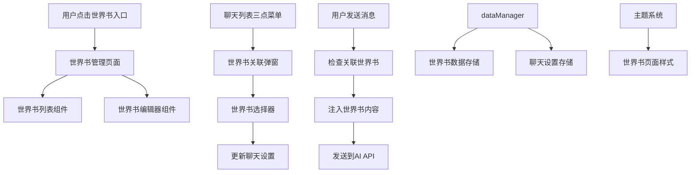

# 世界书系统设计文档

## 概述

设计一个完整的世界书管理系统，允许用户创建、编辑、删除世界书，并将其关联到不同的AI角色和群聊。系统将在用户与AI聊天时自动将关联的世界书内容注入到系统提示词中，为AI提供丰富的背景信息。

## 架构

### 系统架构图



### 技术架构

1. **数据层**: 使用现有的dataManager进行世界书数据的CRUD操作
2. **组件层**: 创建专门的世界书管理和关联组件
3. **业务逻辑层**: 实现世界书内容注入到AI系统提示词的逻辑
4. **UI层**: 与现有主题系统集成，提供一致的用户体验

## 组件和接口

### 1. 数据结构扩展

#### WorldBook接口（已存在）
```typescript
export interface WorldBook {
  id: string;
  name: string;
  content: string;
  createdAt: number;
  updatedAt: number;
  description?: string; // 世界书描述
}
```

#### dataManager扩展方法
```typescript
class DataManager {
  // 世界书CRUD操作
  async saveWorldBook(worldBook: WorldBook): Promise<void>;
  async getAllWorldBooks(): Promise<WorldBook[]>;
  async getWorldBook(id: string): Promise<WorldBook | null>;
  async deleteWorldBook(id: string): Promise<void>;
  async updateWorldBook(worldBook: WorldBook): Promise<void>;
}
```

### 2. 核心组件设计

#### WorldBookListPage组件
```typescript
interface WorldBookListPageProps {
  onBack: () => void;
}

interface WorldBookListPageState {
  worldBooks: WorldBook[];
  isLoading: boolean;
  showEditor: boolean;
  editingWorldBook: WorldBook | null;
}

export default function WorldBookListPage(props: WorldBookListPageProps): JSX.Element;
```

#### WorldBookEditor组件
```typescript
interface WorldBookEditorProps {
  worldBook?: WorldBook | null;
  onSave: (worldBook: WorldBook) => void;
  onCancel: () => void;
}

interface WorldBookEditorState {
  name: string;
  content: string;
  description: string;
  isSaving: boolean;
}

export default function WorldBookEditor(props: WorldBookEditorProps): JSX.Element;
```

#### WorldBookAssociationModal组件
```typescript
interface WorldBookAssociationModalProps {
  isVisible: boolean;
  chatId: string;
  currentLinkedIds: string[];
  onClose: () => void;
  onSave: (linkedIds: string[]) => void;
}

interface WorldBookAssociationModalState {
  worldBooks: WorldBook[];
  selectedIds: string[];
  isLoading: boolean;
}

export default function WorldBookAssociationModal(props: WorldBookAssociationModalProps): JSX.Element;
```

### 3. 系统提示词注入逻辑

#### WorldBookInjector类
```typescript
class WorldBookInjector {
  static async injectWorldBooks(
    chatId: string,
    originalPrompt: string,
    linkedWorldBookIds: string[]
  ): Promise<string> {
    if (!linkedWorldBookIds.length) return originalPrompt;
    
    const worldBooks = await Promise.all(
      linkedWorldBookIds.map(id => dataManager.getWorldBook(id))
    );
    
    const validWorldBooks = worldBooks.filter(wb => wb !== null) as WorldBook[];
    
    if (!validWorldBooks.length) return originalPrompt;
    
    const worldBookContent = validWorldBooks
      .map(wb => `## ${wb.name}\n${wb.content}`)
      .join('\n\n');
    
    return `${originalPrompt}\n\n# 世界设定\n${worldBookContent}`;
  }
}
```

## 数据模型

### 世界书数据存储

#### IndexedDB存储结构
```typescript
// 新增世界书存储
const WORLD_BOOK_STORE = 'worldBooks';

// 在initDB中添加
if (!db.objectStoreNames.contains(WORLD_BOOK_STORE)) {
  const worldBookStore = db.createObjectStore(WORLD_BOOK_STORE, { keyPath: 'id' });
  worldBookStore.createIndex('name', 'name', { unique: false });
  worldBookStore.createIndex('createdAt', 'createdAt', { unique: false });
}
```

### 聊天设置关联

现有的ChatSettings接口已包含`linkedWorldBookIds: string[]`字段，无需修改。

## 用户界面设计

### 1. 世界书管理页面

#### 页面布局
- **顶部导航栏**: 包含返回按钮、页面标题"世界书管理"、创建按钮
- **世界书列表**: 卡片式布局，显示世界书名称、描述预览、操作按钮
- **空状态**: 当没有世界书时显示引导创建的界面

#### 世界书卡片设计
```css
.world-book-card {
  background: var(--theme-bg-secondary);
  border: 1px solid var(--theme-border-color);
  border-radius: 12px;
  padding: 16px;
  margin-bottom: 12px;
}

.world-book-title {
  color: var(--theme-text-primary);
  font-size: 16px;
  font-weight: 600;
  margin-bottom: 8px;
}

.world-book-preview {
  color: var(--theme-text-secondary);
  font-size: 14px;
  line-height: 1.4;
  margin-bottom: 12px;
  display: -webkit-box;
  -webkit-line-clamp: 2;
  -webkit-box-orient: vertical;
  overflow: hidden;
}

.world-book-actions {
  display: flex;
  gap: 8px;
  justify-content: flex-end;
}
```

### 2. 世界书编辑器

#### 编辑器布局
- **顶部**: 世界书名称输入框
- **中部**: 大型多行文本编辑区域
- **底部**: 保存、取消按钮

#### 编辑器样式
```css
.world-book-editor {
  background: var(--theme-bg-primary);
  height: 100vh;
  display: flex;
  flex-direction: column;
}

.editor-header {
  background: var(--theme-header-bg);
  padding: 16px;
  border-bottom: 1px solid var(--theme-border-color);
}

.editor-content {
  flex: 1;
  padding: 16px;
  display: flex;
  flex-direction: column;
  gap: 16px;
}

.world-book-name-input {
  background: var(--theme-bg-secondary);
  border: 1px solid var(--theme-border-color);
  border-radius: 8px;
  padding: 12px;
  color: var(--theme-text-primary);
  font-size: 16px;
}

.world-book-content-textarea {
  background: var(--theme-bg-secondary);
  border: 1px solid var(--theme-border-color);
  border-radius: 8px;
  padding: 12px;
  color: var(--theme-text-primary);
  font-size: 14px;
  line-height: 1.5;
  resize: none;
  flex: 1;
  min-height: 300px;
}
```

### 3. 世界书关联弹窗

#### 弹窗布局
- **标题**: "关联世界书"
- **世界书列表**: 复选框列表，显示所有可用世界书
- **操作按钮**: 确定、取消

#### 关联弹窗样式
```css
.world-book-association-modal {
  background: var(--theme-bg-primary);
  border-radius: 12px;
  max-height: 70vh;
  overflow: hidden;
  display: flex;
  flex-direction: column;
}

.association-header {
  padding: 20px;
  border-bottom: 1px solid var(--theme-border-color);
}

.association-content {
  flex: 1;
  overflow-y: auto;
  padding: 16px;
}

.world-book-option {
  display: flex;
  align-items: flex-start;
  gap: 12px;
  padding: 12px;
  border-radius: 8px;
  margin-bottom: 8px;
  cursor: pointer;
  transition: background-color 0.2s;
}

.world-book-option:hover {
  background: var(--theme-bg-tertiary);
}

.world-book-checkbox {
  margin-top: 2px;
}

.world-book-info {
  flex: 1;
}

.world-book-option-title {
  color: var(--theme-text-primary);
  font-weight: 500;
  margin-bottom: 4px;
}

.world-book-option-preview {
  color: var(--theme-text-secondary);
  font-size: 13px;
  line-height: 1.4;
  display: -webkit-box;
  -webkit-line-clamp: 2;
  -webkit-box-orient: vertical;
  overflow: hidden;
}
```

## 错误处理

### 1. 数据操作错误

- **世界书保存失败**: 显示错误提示，允许用户重试
- **世界书加载失败**: 显示加载错误状态，提供刷新选项
- **世界书删除失败**: 显示错误提示，保持原有状态

### 2. 关联操作错误

- **关联保存失败**: 显示错误提示，恢复到之前的关联状态
- **世界书不存在**: 自动从关联列表中移除无效的世界书ID

### 3. 系统提示词注入错误

- **世界书内容获取失败**: 跳过该世界书，继续处理其他世界书
- **注入过程异常**: 使用原始系统提示词，记录错误日志

## 测试策略

### 1. 单元测试

- **WorldBookInjector类测试**: 测试世界书内容注入逻辑
- **dataManager扩展方法测试**: 测试世界书CRUD操作
- **组件渲染测试**: 测试各个组件的正确渲染

### 2. 集成测试

- **世界书管理流程测试**: 测试创建、编辑、删除世界书的完整流程
- **世界书关联测试**: 测试世界书与聊天的关联和取消关联
- **AI聊天集成测试**: 测试世界书内容在AI聊天中的正确注入

### 3. 用户体验测试

- **响应式测试**: 测试在不同设备尺寸下的界面表现
- **主题兼容性测试**: 测试在不同主题下的视觉效果
- **性能测试**: 测试大量世界书时的加载和操作性能

## 实现细节

### 1. 文件组织结构

```
C:\Projects\phone\src\app\components\qq\worldbook\
├── WorldBookListPage.tsx          # 世界书管理页面
├── WorldBookListPage.css          # 世界书管理页面样式
├── WorldBookEditor.tsx            # 世界书编辑器
├── WorldBookEditor.css            # 世界书编辑器样式
├── WorldBookAssociationModal.tsx  # 世界书关联弹窗
├── WorldBookAssociationModal.css  # 世界书关联弹窗样式
├── WorldBookCard.tsx              # 世界书卡片组件
├── WorldBookCard.css              # 世界书卡片样式
└── index.ts                       # 导出文件
```

### 2. 路由集成

在ChatListHeader.tsx中添加世界书入口：
```typescript
// 在用户下拉菜单中添加
<div className="dropdown-item" onClick={() => { setShowUserDropdown(false); onOpenWorldBook(); }}>
  <svg width="16" height="16" viewBox="0 0 24 24" fill="none" xmlns="http://www.w3.org/2000/svg">
    <path d="M4 19.5A2.5 2.5 0 0 1 6.5 17H20" stroke="currentColor" strokeWidth="2"/>
    <path d="M6.5 2H20v20H6.5A2.5 2.5 0 0 1 4 19.5v-15A2.5 2.5 0 0 1 6.5 2z" stroke="currentColor" strokeWidth="2"/>
  </svg>
  <span>世界书</span>
</div>
```

### 3. 数据库扩展

在dataManager.ts中添加世界书相关方法：
```typescript
// 添加世界书存储常量
const WORLD_BOOK_STORE = 'worldBooks';

// 在initDB的onupgradeneeded中添加
if (!db.objectStoreNames.contains(WORLD_BOOK_STORE)) {
  const worldBookStore = db.createObjectStore(WORLD_BOOK_STORE, { keyPath: 'id' });
  worldBookStore.createIndex('name', 'name', { unique: false });
  worldBookStore.createIndex('createdAt', 'createdAt', { unique: false });
}
```

### 4. 主题变量使用

所有世界书相关组件都使用现有的主题变量：
- `--theme-bg-primary`: 主要背景色
- `--theme-bg-secondary`: 次要背景色
- `--theme-bg-tertiary`: 第三级背景色
- `--theme-text-primary`: 主要文字颜色
- `--theme-text-secondary`: 次要文字颜色
- `--theme-border-color`: 边框颜色
- `--theme-accent-color`: 强调色

### 5. 系统提示词注入位置

在发送消息给AI时，世界书内容将被注入到系统提示词的末尾：
```
原始系统提示词...

# 世界设定
## 世界书1名称
世界书1内容...

## 世界书2名称
世界书2内容...
```

## 性能优化

### 1. 数据缓存

- 在内存中缓存常用的世界书内容
- 使用懒加载策略，只在需要时加载世界书内容

### 2. UI优化

- 使用虚拟滚动处理大量世界书列表
- 实现防抖搜索功能
- 优化长文本的显示和编辑性能

### 3. 网络优化

- 批量处理世界书关联更新
- 压缩世界书内容存储
- 实现增量同步机制